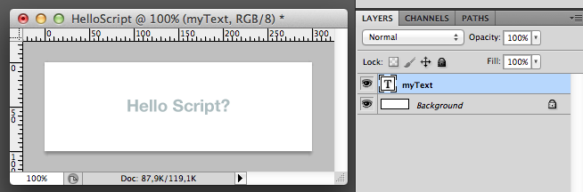
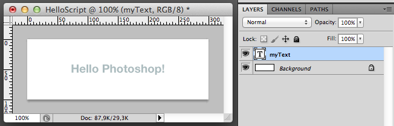

###A short introduction to coding with JavaScript in Photoshop

Scripting in Photoshop is easier than one might think. I learned the basics late last night, and today I made a script that updates a graph, complete with values, markers, x- and y-axis, curves and more. So here’s a few hints to get you started.

Make a new Photoshop file, add text with the Type Tool. For example, type “Hello Script?”. Rename the text layer to “myText”. Do not put the layer in a group.

Now make a new text file, in Notepad or similar, save it somewhere as demo.jsx. We’ll be using javascript as our scripting language here, which is valid on both OSX and Windows.

In the file, add this code:

	var myText = app.activeDocument.layers.getByName("myText");
	myText.textItem.contents = "Hello Photoshop!";

Save the file.

Now, from Photoshop, go to File/Scripts/Browse… and locate your demo.jsx file. Open it, and violá! Your text should now have changed from “Hello Script?” to “Hello Photoshop!”.

There are many things you can do like this directly with javascript, I suggest you use Google to investigate. For example, if you want to know how to move a layer, try googling for “Photoshop javascript move layer”.

HOWEVER… this is also where things get both annoying and liberating at the same time, and is the key element of my hard earned lessons last night. The thing is, such a simple thing as moving a layer to, for example, x=100px, y=50px, is not so easy as it seems. Photoshop deals with something called translate, not move. So, translate basically lets you move a layer, relative to its current position. So now you start to need some math, which is kinda annoying. To place a layer at the above coordinates, based on the center of the layer, you need something like this:

	positionLayerCenter("myText", 100, 50);
 
	function positionLayerCenter( lyr, x, y ){
    	var lyr1 = activeDocument.artLayers.getByName(lyr)
    	// if can not move layer return
    	if(lyr1.iisBackgroundLayer||lyr.positionLocked) return
    	// get the layer bounds
    	var layerBounds = lyr1.bounds;
    	// get top left position
    	var layerX = (layerBounds[0].value + layerBounds[2].value)/2;
    	var layerY = (layerBounds[1].value + layerBounds[3].value)/2;
    	// the difference between where layer needs to be and is now
    	var deltaX = x-layerX;
    	var deltaY = y-layerY;
    	// move the layer into position
    	lyr1.translate (deltaX, deltaY);
	}

So it can get annoying. It’s a lot of code for something that seems like such a simple task. And all the time you’d have to Google for snippets of code like this.

But there’s another way, which is what I meant by things being liberating. You can actually have Photoshop give you all this code! It’s not very pretty, but it works, and everything does get a lot easier. Introducing ScriptListener!

ScriptListener is actually Photoshops own little way of translating everything you do in Photoshop, into javascript. All the output comes out in a file on your desktop, ready for you to copy into your script.

On your machine, navigate to your Photoshop folder. Go to the subfolder Scripting/Utilities/, and locate the file called ScriptingListener.plugin. Copy this file, and paste it into your Plugins/Automate/ folder. Now restart your Photoshop, and as soon as you start to do something, notice there’s now a file on your desktop called ScriptingListenerJS.log. You can open this with Notepad or similar.

So, for example, if I in Photoshop select the “Background” layer, here’s the output i get from the log file:

	// =======================================================
	var idslct = charIDToTypeID( "slct" );
    	var desc96 = new ActionDescriptor();
    	var idnull = charIDToTypeID( "null" );
        	var ref60 = new ActionReference();
        	var idLyr = charIDToTypeID( "Lyr " );
        	ref60.putName( idLyr, "Background" );
    	desc96.putReference( idnull, ref60 );
    	var idMkVs = charIDToTypeID( "MkVs" );
    	desc96.putBoolean( idMkVs, false );
	executeAction( idslct, desc96, DialogModes.NO );

It’s not pretty code, no, but once you get the hang of it, you’ll find out how incredibly useful this is. Most of the time you can easily guess what’s going on, for example here, in line 2, you’ve “selected” something (slct). In line 7, you can see the layer you’ve selected, “Background”.

Now you can turn this into functions, and reuse it again and again. Simply add a function around the code, like this:

	function selectLayer(nameOfLayer) {
	    // =======================================================
	    var idslct = charIDToTypeID( "slct" );
	    var desc96 = new ActionDescriptor();
	    var idnull = charIDToTypeID( "null" );
	        var ref60 = new ActionReference();
	        var idLyr = charIDToTypeID( "Lyr " );
	        ref60.putName( idLyr, "Background" );
	    desc96.putReference( idnull, ref60 );
	    var idMkVs = charIDToTypeID( "MkVs" );
	    desc96.putBoolean( idMkVs, false );
	    executeAction( idslct, desc96, DialogModes.NO );
	}

Now, whenever you need to select a layer, for example the “myText” layer, run this code:

	selectLayer("myText");

That’s all I had for now. One last thing though, don’t forget that you can always delete all the content of the ScriptListenerJS.log file. This will help you keep track of what code you need. And also, if you don’t want to have Photoshop log everything anymore, simply delete the ScriptingListener.plugin file from your Photoshop/Plugins/Automate/ folder, and restart Photoshop.
